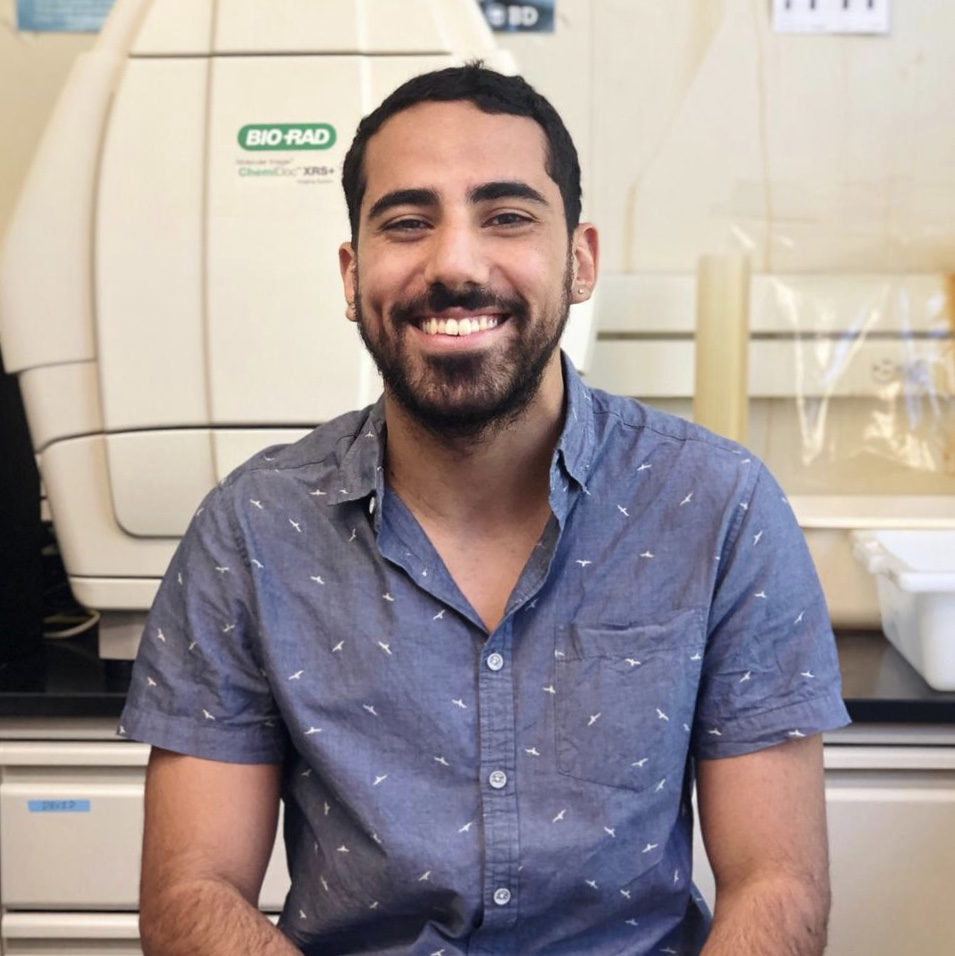

<!DOCTYPE html>
<html>
<meta name="viewport" content="width=device-width, initial-scale=1">

<link rel="stylesheet" href="https://www.w3schools.com/w3css/4/w3.css">

***

<h3 style="padding:15px;">
Lab Technicians
</h3>

  

  
  

  

  <h5>Miosotis Alicea Delgado</h5>
  Laboratory Manager and Research Assistant  
  aliceadelgadom@gmail.com
  

  

  
  

  

  Griselle Valentin
  

***

####Grad Students

  

  
  

  

  <h5>Samir Bello</h5>
  PhD Student  
  samir.bello3@gmail.com
  

  

  
  

  

  <h5>Lymarie Diaz-Diaz </h5>
  PhD Student  
  lymarie.diaz@upr.edu  
  
I am currently characterizing the role of microbiota during regeneration processes on sea cucumber Holothuria glaberrima. The intestine is associated with a high density of microorganisms that regulate multiple processes, from metabolism to development and homeostasis of the whole body. With an organism that has an amazing potential to regenerate the whole digestive tract, we can study this processes in more depth. With this project, I aim to decipher the microbial association that are pivotal to regeneration, and what processes are influenced by those microorganisms. 

  

  

  
  

  

  <h5>Joshua G. Medina-Feliciano</h5>
  PhD Graduate Student  
  NSF Bridge to the Doctorate Program Fellow - Cohort XII  
  joshua.medina8@upr.edu  
  

  

  
  

  

  <h5>David Quispe-Parra</h5>
  M.S. Student 
  davidjquispe@gmail.com 
  

  

  
  

  

  <h5>Eliel Rivera</h5>
  M.S. Student 
  eliel.rivera@upr.edu 
  

  

  
  

  

  <h5>Jose Alexis Rodriguez</h5>
  M.S. Student 
  davidjquispe@gmail.com 
  

  

  
  

  

  <h5>Rey Rosa</h5>
  PhD Student 
  reyrosa@hotmail.com 
  

  

  
  

  

  <h5>Saely Rosado</h5>
  M.S. Student 
  saely.rosado@upr.edu 
  

  

  
  

  

  <h5>Fernando Ruiz</h5>
  M.S. Student 
  fernando.ruiz3@upr.edu 
  

  

  
  

  

  <h5>Arisnel Soto</h5>
  PhD Student 
  arisnel_07@hotmail.com 
  

####Undergraduate Students

* Alexandra Amador
* Ariana Caraballo
* Sebastian Cruz
* Angela Colon
* Alejandro Cedeno
* Raul Garcia-Rosario
* Ruben Garcia
* Cristina Gerena
* Carlos Martinez
* Luis Medina
* Thaybet Malave
* Omar Perez
* Eduardo Quesada
* Tathana Rivera
* Carlos Rodriguez
* Wilyaret Rodriguez
* Angelica Romero
* Joseph Salem
* Kidianys Sanchez
* Angel Sirfa
* Fabiola Sotomayor

 
 
 
 
 
 
 
 
        

